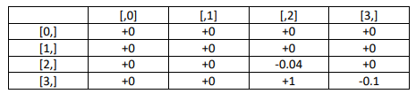

# Grid World Value Iteration Project

## Overview
This project demonstrates reinforcement learning on a simple 4x4 grid world. The agent learns to find the optimal path to a reward while avoiding negative rewards.

## The Environment



Our grid world is a 4×4 grid where:
- Position (3,2) has a high reward (+1)
- Position (2,2) has a small negative reward (-0.04)
- Position (3,3) has a larger negative reward (-0.1)
- All other positions have zero reward


The agent can move in 8 directions (king's moves in chess) or stay in place:
- NOP - stay in place
- Up
- Up-Right
- Right
- Down-Right
- Down
- Down-Left
- Left
- Up-Left

## How It Works

### Value Iteration Algorithm
We use value iteration to find the optimal policy:

1. **Initialize** a value map (V) with zeros
2. **Repeat until convergence**:
   - For each state, calculate the value of taking each action
   - Update the state's value to the maximum action value
   - Update the policy to choose the best action
3. **Result**: An optimal policy telling the agent where to move from any position

### The Policy
Once trained, the policy tells the agent which direction to move in each state. The optimal policy guides the agent to the goal state [3,2] with the +1 reward, while avoiding the negative reward states [2,2] and [3,3].

## Sample Trajectory

Starting from position (0,2), the agent follows the policy:

```
Step-by-step simulation:
----------------------------------------
Step  State      Action     Reward    
----------------------------------------
    0 (0, 2)     N/A              0.00
    1 (1, 3)     DownRight        0.00
    2 (2, 3)     DownRight        0.00
    3 (3, 2)     DownLeft         1.00
    4 (3, 2)     NOP              1.00
----------------------------------------
Total reward: 2.00
```

## Key Components

The project consists of several key components:

1. **GridWorld Class**: Defines the environment, rewards, and actions
2. **Value Iteration Function**: Calculates the optimal value function and policy
3. **Visualization Functions**: Displays the value function and policy
4. **Simulation Functions**: Tests the policy by running episodes

## Running the Code

```bash
# Install required packages
pip install numpy matplotlib seaborn
```

Or open and run `apex_agent/simulation.ipynb` in Jupyter Notebook.

## Key Concepts Illustrated

This simple project demonstrates fundamental reinforcement learning concepts:

- **Value Function**: How "good" it is to be in each state
- **Policy**: A map of what action to take in each state
- **Discount Factor (γ=0.9)**: How much to value future rewards
- **Bellman Equation**: The recursive relationship for optimal values
- **Convergence**: How we know when we've found the solution

## The Bellman Equation in This Project

In our grid world, the Bellman equation helps us find the best path to treasure. Here's how it works:

V(s) = max_a [ R + γ * V(s') ]

Where:
- V(s) is the value of being in a particular grid cell
- R is the reward (which can be defined in different ways)
- γ (gamma = 0.9) determines how much we care about future rewards
- V(s') is the value of the next cell we'd move to

### Two Different Reward Function Approaches

We explored two different ways to define the reward function:

#### 1. Destination-Based Rewards R(s')

Initially, we implemented rewards based on the destination state:

```python
# Using R(s') - reward based on destination state
next_state = env.get_next_state(state, action)
reward = env.get_reward(next_state)  # Reward for arriving at next_state
q_value = reward + gamma * V[next_state]
```

This creates this value function:


Notice how cells with negative immediate rewards still have high values because they're close to the +1 reward state.

#### 2. State-Action Based Rewards R(s,a)

We then implemented rewards based on the current state and action:

```python
# Using R(s,a) - reward based on current state and action
next_state = env.get_next_state(state, action)
reward = env.get_reward(state)  # Reward for being in current state
q_value = reward + gamma * V[next_state]
```

This creates a more intuitive value function:


With this approach, cells with negative rewards clearly show lower values, creating a more intuitive "map" that better visualizes which areas to avoid.

We chose the R(s,a) approach for our final implementation because it produces a value function that more intuitively represents the grid world's reward structure, making it easier to understand the optimal path.

## Conclusions

- The optimal policy guides the agent to the goal state [3,2] with the +1 reward
- The agent avoids the negative reward states [2,2] and [3,3]
- Once at the goal state, the optimal action is NOP (stay in place)
- The value function shows propagation of the reward values through the grid